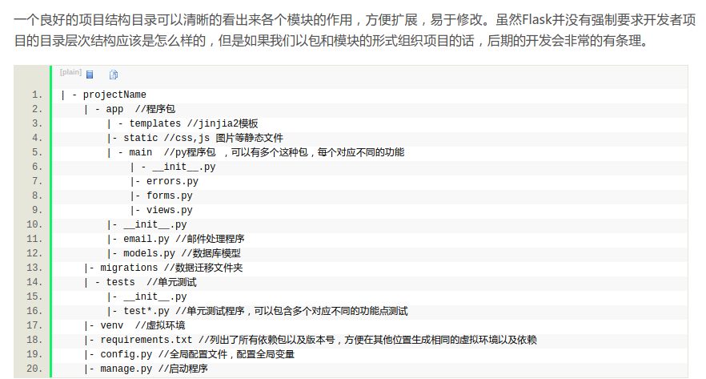

1. 如何产生验证码：
    1. 首先呢，现在就需要去确定一下，就是，其实flask的结构应该是长什么样子的呢？？
        1. 解答：[python3.6 flask web学习]Flask项目目录结构https://blog.csdn.net/xingyunlost/article/details/77155584
        

        2. 这个网址可以产生验证码：https://blog.csdn.net/wuqing942274053/article/details/75196130

        3. 又有疑问了，请问一下，Image,ImageFont,ImageDraw,ImageFile这4个有有什么用？
        4. 用途。首先说明都是导入PIL模块，安装方法是pip install pillow
            1. Image 操作图像
            来看看最常见的图像缩放操作，只需三四行代码：
            ```python
            import Image

            # 打开一个jpg图像文件，注意路径要改成你自己的:
            im = Image.open('/Users/michael/test.jpg')
            # 获得图像尺寸:
            w, h = im.size
            # 缩放到50%:
            im.thumbnail((w//2, h//2))
            # 把缩放后的图像用jpeg格式保存:
            im.save('/Users/michael/thumbnail.jpg', 'jpeg')
            其他功能如切片、旋转、滤镜、输出文字、调色板等一应俱全。

            比如，模糊效果也只需几行代码：

            import Image, ImageFilter

            im = Image.open('/Users/michael/test.jpg')
            im2 = im.filter(ImageFilter.BLUR)
            im2.save('/Users/michael/blur.jpg', 'jpeg')
            ```

            2. ImageDraw 提供了一系列绘图方法，让我们可以直接绘图。比如要生成字母验证码图片：
                所以，ImageFont是用于获取本机里面真实可用的字体，ImageFilte用于模糊字体？
            ```python
            import Image, ImageDraw, ImageFont, ImageFilter
            import random

            # 随机字母:
            def rndChar():
                return chr(random.randint(65, 90))

            # 随机颜色1:
            def rndColor():
                return (random.randint(64, 255), random.randint(64, 255), random.randint(64, 255))

            # 随机颜色2:
            def rndColor2():
                return (random.randint(32, 127), random.randint(32, 127), random.randint(32, 127))

            # 240 x 60:
            width = 60 * 4
            height = 60
            image = Image.new('RGB', (width, height), (255, 255, 255))
            # 创建Font对象:
            font = ImageFont.truetype('Arial.ttf', 36)
            # 创建Draw对象:
            draw = ImageDraw.Draw(image)
            # 填充每个像素:
            for x in range(width):
                for y in range(height):
                    draw.point((x, y), fill=rndColor())
            # 输出文字:
            for t in range(4):
                draw.text((60 * t + 10, 10), rndChar(), font=font, fill=rndColor2())
            # 模糊:
            image = image.filter(ImageFilter.BLUR)
            image.save('code.jpg', 'jpeg');
            ```
        5. 生成的图像都是需用用其他模块来做一下转换的，转换到字节码？？？？就是010101？？？
            1. 暂时这里了解到的是，使用 from io import BytesIO
            2. 

        6. 现在还有一个疑问，就是PIL里面的images的save可以有多少种保存格式？看看有没有官方文档先！
            1. 

    2. 突然有个小疑问，就是，markdown可以插入本地图片吗？即使是当前本地目录来导入。
        1. 解答
        MarkDown添加图片的三种方式：https://www.jianshu.com/p/280c6a6f2594
        插入本地图片
        只需要在基础语法的括号中填入图片的位置路径即可，支持绝对路径和相对路径。
        例如：
        ```python
        
        ```